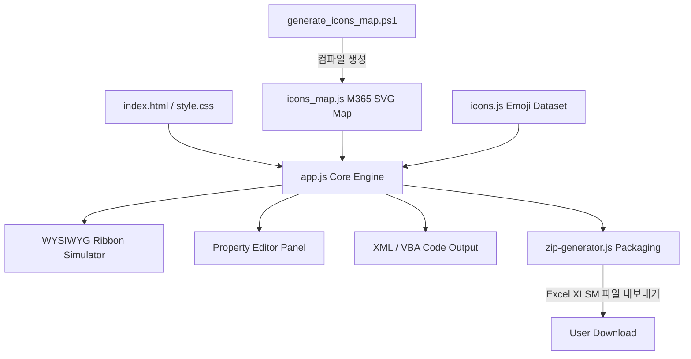

# Excel Custom Ribbon Creator 개발 기획서 (Development Specification & Plan)

본 기획서는 엑셀 Fluent UI 표준 규격의 Custom UI XML과 VBA 콜백 코드를 시각적인 환경에서 제작, 편집, 시뮬레이션하고 최종 파일 패키징(.xlsm)까지 지원하는 **Excel Custom Ribbon Creator**의 설계 및 개발 명세서입니다.

---

## 📌 1. 프로젝트 개요

### 1.1 배경 및 목적
엑셀의 리본 메뉴를 사용자 정의(Custom UI)하기 위해서는 난해한 XML 스키마를 직접 코딩해야 하며, 소형/대형 컴포넌트 배치, 아이콘 매핑(imageMso), VBA 이벤트 핸들러 매칭 등 복잡한 수작업과 테스트 디버깅 시간이 소요됩니다. 
본 프로젝트는 이러한 과정을 웹 기반의 **인터랙티브 WYSIWYG(What You See Is What You Get) 시뮬레이션 환경**으로 전환하여 개발 생산성을 높이고, 엑셀 순정 Fluent UI 스펙을 준수하는 리본 확장 도구를 간편하게 제작할 수 있도록 지원하는 것을 목적으로 합니다.

### 1.2 주요 목표
- **시각적 실시간 시뮬레이션**: 드래그 앤 드롭 및 4방향 D-Pad 정렬 조작을 통한 리본 메뉴 실시간 모델링.
- **수학적 무결성의 코드 컴파일**: 엑셀 표준 스키마 및 가이드 규격을 완벽하게 준수하는 XML 및 VBA 시퀀스 코드 실시간 컴파일.
- **로컬 스캐너 연동을 통한 확장성**: 파워셸(PowerShell) 기반 스캐너를 통해 사용자의 고해상도 M365 SVG 아이콘 자산을 무설정 탭으로 동적 로드.
- **다운로드 및 배포 자동화**: 브라우저 순수 패키징 모듈(JSZip)을 사용하여, XML 주입이 완료된 최종 매크로 포함 통합 문서(`.xlsm`) 자동 인코딩 다운로드.

---

## 🎨 2. 주요 기능 정의

### 2.1 실시간 WYSIWYG 리본 시뮬레이터 (Simulator)
- **탭/그룹/컨트롤 계층형 렌더링**: 엑셀 순정 테마와 동일한 11px 통일 글꼴 크기 및 부드러운 HSL 연두/초록 스타일 테마 적용.
- **하이브리드 요소 추가**: 왼쪽 팔레트의 10가지 컨트롤 요소를 단순히 클릭하여 삽입하거나, 원하는 타겟 그룹 상자로 마우스를 끌어다 드롭하는 드래그 앤 드롭 추가 기능.
- **시뮬레이터 내부 드래그 앤 드롭 재정렬**: 이미 배치된 컨트롤이나 구분선이 시뮬레이터 내에서 마우스 드래그하여 원하는 위치 바로 앞으로 정밀 재정렬. 구분선(`separator`) 위로 지나갈 때는 4px 밝은 연두색 Active 삽입 바가 활성화되어 안내.
- **소형 컨트롤 4방향 D-Pad 이동**: 
  - 세로로 최대 3단 적층(Stacking)되는 소형 컨트롤에 대해 위/아래 이동(`▲`/`▼`, index ±1)과 좌/우 컬럼 점프 이동(`◀`/`▶`, index ±3)을 지원.
  - 대형 컨트롤 및 구분선은 가로 컬럼 단위 좌/우 이동(`◀`/`▶`, index ±1)만 활성화.

### 2.2 지능형 레이아웃 및 엑셀 스키마 컴파일러 (Compiler)
- **자동 3단 세로 Stacking**: 대형 버튼이나 구분선을 만나기 전까지 연속된 소형 컨트롤을 최대 3개 단위의 세로 스택 열(`.ribbon-column-vertical-sim`)로 모아 자동 밀착 레이아웃 배치.
- **Fluent UI `<box>` 규격 감싸기**: 시뮬레이터의 세로 열 정렬에 맞추어 생성되는 `CustomUI.xml` 내부 소형 컨트롤들을 엑셀 표준 박스 스키마인 `<box boxStyle="vertical">` 구조로 안전하게 감싸서 컴파일.
- **VBA 매크로 핸들러 자동 생성**: 각 컨트롤의 ID, 유형(checkbox: `checked`, editbox/combobox: `text`, button: `onAction`)에 부합하는 VBA 시그니처 함수 블록을 실시간 작성.

### 2.3 다중 계층 2단 하위 탭 아이콘 피커 (Searchable Icon Picker)
- **M365 고해상도 로컬 아이콘 연동**: `generate_icons_map.ps1` 파워셸 스크립트를 통해 로컬 폴더구조(`Level 1: 폴더군` -> `Level 2: 상세 하위폴더` -> `SVG 파일`)를 분석해 `icons_map.js`로 빌드. 브라우저에서 이를 읽어 2계층 동적 Sub-tab을 조립하고 이미지 태그로 고해상도 출력.
- **5대 윈도우 스타일 Emoji 탭**: `icons.js` 내에 기호 아이콘을 윈도우 기본 이모지 필터 규격과 일치하게 5대 그룹(웃는 얼굴, 동물/자연, 피플/활동, 사물, 기호)으로 나누어 로드 및 검색 지원.

### 2.4 토글 버튼의 라디오 그룹화
- 토글 버튼(`togglebutton`)에 라디오 그룹명(`toggleGroup`) 속성을 바인딩. 동일 그룹 내에서 하나의 버튼을 누르면 다른 토글 버튼들은 물리적으로 눌림 효과가 해제(`checked = false`)되는 배타적 단일 선택 로직 설계.
- 시뮬레이터 상에 `○` 및 `●` 기호를 레이블 옆에 표시해 주며, 선택된 것은 쑥 눌린 입체 섀도우 효과(`.pressed`) 부여.

### 2.5 자주 사용하는 VBA 매크로 프리셋 라이브러리 (완료)
- **실무 프리셋 탑재**: 엑셀 실무에서 자주 사용되는 시트 보호 및 해제 토글, 선택 범위 PDF 내보내기, 열 너비 및 행 높이 자동 맞춤, 중복 데이터 제거, 워크시트 취합 동작을 내장된 버튼으로 제공.
- **속성 연결 및 직접 편집**: 컨트롤 속성 편집 영역 아래에 프리셋 연결 드롭다운과 연결된 코드가 로드되어 편집 가능한 텍스트 영역 제공.
- **동적 명칭 연동**: VBA callback 컴파일러와 100% 매핑되며, 컨트롤의 `onAction` 명칭이 바뀔 시 Sub 함수 선언 부분의 함수명이 실시간 정규표현식 매칭을 통해 안전하게 자동 변경됩니다.

---

## 💻 3. 아키텍처 및 기술 스택

### 3.1 아키텍처
본 프로그램은 서버 환경이나 데이터베이스가 전혀 필요 없는 **100% 클라이언트 사이드 정적 웹 애플리케이션 (Static Web App)** 구조입니다.
- **마크업 & 스타일**: 세련되고 현대적인 엑셀 테마(Harmonious Green & Clean HSL Palette, Inter 폰트, Glassmorphism, Micro-animations)가 적용된 Vanilla HTML5 및 CSS3.
- **애플리케이션 로직**: Vanilla JavaScript ES6+ 기반 상태 중심 렌더러 구현.
- **자동화 스캐너**: 로컬 아이콘 자산 컴파일용 PowerShell 스크립트.
- **패키저**: 브라우저 내 통합문서 ZIP 인코딩용 JSZip.



---

## 📊 4. 데이터 모델 설계

### 4.1 글로벌 상태 구조 (`ribbonState`)
전체 리본의 설계 데이터는 단일 트리형 JSON 객체인 `ribbonState`로 관리되며, 수정 즉시 UI 리렌더링 및 코드 컴파일이 순차 실행됩니다.

```json
{
  "tabs": [
    {
      "id": "customTab_Automate",
      "label": "업무 자동화 도구",
      "visible": true,
      "isStandardTab": false,
      "idMso": "",
      "groups": [
        {
          "id": "group_DataCompile",
          "label": "데이터 전처리",
          "visible": true,
          "controls": [
            {
              "id": "btn_MergeFiles",
              "type": "button",
              "label": "파일 취합",
              "size": "large",
              "imageMso": "icons/2024-microsoft-365-content-icons/Microsoft Blue/48x48 Light Blue Icon/Folder Open.svg",
              "onAction": "btn_MergeFiles_Click",
              "enabled": true,
              "visible": true
            },
            {
              "id": "chk_BackupFirst",
              "type": "checkbox",
              "label": "자동 백업",
              "onAction": "chk_BackupFirst_Click",
              "enabled": true,
              "visible": true,
              "checked": true
            }
          ]
        }
      ]
    }
  ]
}
```

---

## 🚀 5. 향후 확장 계획 (Roadmap)

1. **실시간 엑셀 연동 테스트 추가 기능**: 브라우저와 엑셀 간의 웹 소켓이나 로컬 에이전트 연동을 통해, 시뮬레이터에서 수정 시 로컬 엑셀 리본이 실시간으로 갱신되는 핫 리로드(Hot-reload) 모듈 기획.
2. **완벽한 다국어 지원**: 한국어와 영어 Fluent UI 다국어 마크업을 동시 탑재하여 글로벌 리본 제작 환경 제공.
